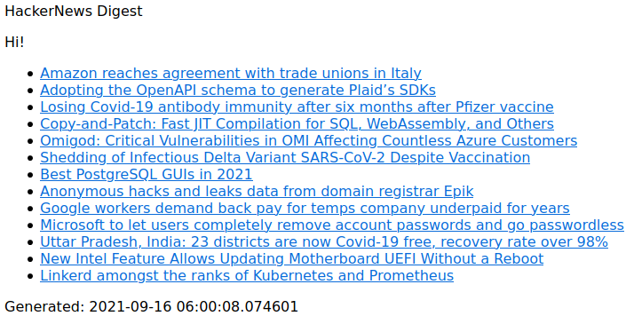

# HackerNews Digest

## Prerequisites

* Python 3.6+
* SQLite 3+

## Install

Run `pip3 install -r requirements.txt`

## Configure

Copy settings.example.py to settings.py and adjust what you think is necessary

If you want to print out the digest in the console, in settings.py set SMTP.EMAIL_HOST to `None`.

For the SMTP configuration, if the user is `None`, a login-less SMTP will be attempted.

## Usage

Run

* `python3 main.py` for getting only the news items complying the filters

OR

* `python3 main.py -r` or `python3 main.py --reverse` for getting only the news items not complying the filters
